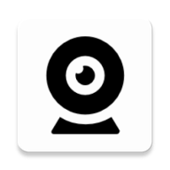

# VCamdroid

VCamdroid is a Windows application that allows you to use your Android phone as a virtual webcam. It leverages a custom DirectShow filter, implemented using the [Softcam library](https://github.com/tshino/softcam), to create a virtual webcam device on your Windows machine. The video stream is fed directly from your Android phone, enabling seamless integration with any application that supports webcams.

<p align="center">
  
</p>

## Features

1. **Multiple Device Support**: Connect and switch between multiple Android devices as video sources.
2. **Custom Resolution**: Adjust resolution to optimize video quality and performance.
3. **Camera Switching**: Remotely toggle between the front and rear cameras of the Android device.
4. **Image Adjustments**: Rotate, flip, and adjust brightness, contrast, and saturation of the video feed.
5. **Connection Options**: Support for both wired (via ADB) and wireless (WiFi) connections.
6. **Compatibility**: VCamdroid can be used by any windows application that has access to webcams
7. **Easy Pairing**: Use QR codes for WiFi pairing and automatically connect if ADB is detected.
8. **Preview Mode**: Preview the video feed before activating the virtual webcam.

## How to install
Download the prebuilt binaries from the [releases](https://github.com/darusc/VCamdroid/releases) page or build them yourself. (See [this](https://github.com/darusc/VCamdroid/blob/main/windows/README.md) for instructions on how to build the server)

Run ```install.bat``` This will register the softcam.dll to the system to make the DirectShow virtual camera filter avaialable to other apps.

To install VCamdroid on your phone make sure your phone is connected to your pc and usb debugging is enabled and run ```install_apk.bat```.

That's all. You can now use the app.

### Usb debugging

First **enable developer mode** - go to **Settings > About**. Find the **Build number** and tap on it seven times. 
  Then go to **Settings > Developer options** and enable USB debugging.
  Build number and developer options location might vary based on your phone model and android version. See https://developer.android.com/studio/debug/dev-options for more details.

## How to use
**If you want to connect with a USB cable you must do the following:**
- Enable usb debugging on your phone. See the last section of **How to install**
- Plug in your phone to your pc.
- Start the windows app.
- Start the android app.

If everything works correctly your phone will automatically connect to the server.

**To connect via WIFI you must do the following:**
- Start both apps, windows and android
- In the windows app go to the connect tab to display the QR code.
- Scan the QR code with the phone app to connect


## How it works

### Networking

The client-server communication is done through a simple custom protocol that is slightly modified based on the connection mode - WIFI or USB via ADB.

In both modes a TCP connection is established beetween the two. This is required to acknowledge connections and detect disconnects and is also used by the server to send commands to the client (like set resolution, change camera etc). The client sends only one message when the connection is initiated - its name.

When the client connects via WIFI an additional UDP connection is established to send the real time video stream. 

Because of **ADB limitations (does not support UDP port forwarding / reversing)** video stream is sent via the same TCP connection. Performance is not impacted as the connection is on localhost - actually it might have better performance than the UDP connection on WIFI.

<p align="center"></p>
<p align="center">Network connection diagram</p>


### Video stream pipeline

Video frames are captured using [CameraX](https://developer.android.com/media/camera/camerax), encoded as JPEG and then sent to the server. The server feeds the received JPEG bytes to a stream for further processing (image transforms and adjustments). After the image is processed it is sent to the UI for live previewing and to the [Softcam library](https://github.com/tshino/softcam) that sends it further to the DirectShow filter that acts a webcam.

<p align="center"></p>
<p align="center">Video stream pipeline</p>
